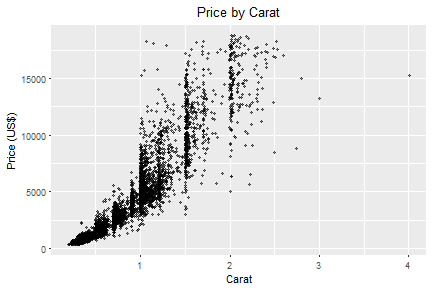

## Diamond Price Estimator

The following plot shows the original distribution of diamond price by caret. As larger diamonds are less rarely available, the price increases exponentially by caret weight as seen below.

This application provides an estimate price of diamond (US$) based on user input/selection of the following criteria:

* **Carat** - weight of the diamond (0.2 - 4)
* **Cut** - quality of the cut (Fair, Good, Very Good, Premium, Ideal)
* **Colour** - diamond colour, from J (worst) to D (best)
* **Clarity** - a measurement of how clear the diamond is (I1 (worst), SI1, SI2, VS1, VS2, VVS1, VVS2, IF (best))

The estimate is based on a subset of 53940 observations taken from the **diamonds** dataset included in the <code>ggplot2</code> R package.
